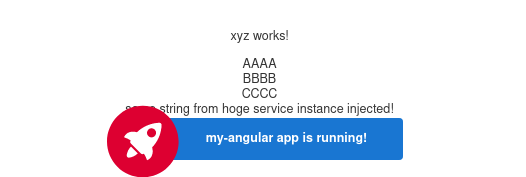

<pre><font color="#A6E22E"><b>ryoji@ubuntu</b></font>:<font color="#66D9EF"><b>~</b></font>$ cd dev
<font color="#A6E22E"><b>ryoji@ubuntu</b></font>:<font color="#66D9EF"><b>~/dev</b></font>$ npm install @angular/cli -save
<span style="background-color:#272822"><font color="#F8F8F2">npm</font></span> <span style="background-color:#F4BF75"><font color="#272822">WARN</font></span> <font color="#AE81FF">deprecated</font> debug@4.2.0: Debug versions &gt;=3.2.0 &lt;3.2.7 || &gt;=4 &lt;4.3.1 have a low-severity ReDos regression when used in a Node.js environment. It is recommended you upgrade to 3.2.7 or 4.3.1. (https://github.com/visionmedia/debug/issues/797)
<span style="background-color:#272822"><font color="#F8F8F2">npm</font></span> <span style="background-color:#F4BF75"><font color="#272822">WARN</font></span> <font color="#AE81FF">deprecated</font> ini@1.3.5: Please update to ini &gt;=1.3.6 to avoid a prototype pollution issue
<span style="background-color:#272822"><font color="#F8F8F2">npm</font></span> <span style="background-color:#F4BF75"><font color="#272822">WARN</font></span> <font color="#AE81FF">deprecated</font> request@2.88.2: request has been deprecated, see https://github.com/request/request/issues/3142
<span style="background-color:#272822"><font color="#F8F8F2">npm</font></span> <span style="background-color:#F4BF75"><font color="#272822">WARN</font></span> <font color="#AE81FF">deprecated</font> har-validator@5.1.5: this library is no longer supported

&gt; @angular/cli@11.0.4 postinstall /media/dev/node_modules/@angular/cli
&gt; node ./bin/postinstall/script.js

<font color="#A6E22E">?</font> <b>Would you like to share anonymous usage data with the Angular Team at Google u</b>
<b>nder</b>
<b>Google’s Privacy Policy at https://policies.google.com/privacy? For more details</b>
<b> and</b>
<b>how to change this setting, see http://angular.io/analytics.</b> <font color="#A1EFE4">No</font>
<span style="background-color:#272822"><font color="#F8F8F2">npm</font></span> <span style="background-color:#F4BF75"><font color="#272822">WARN</font></span> <font color="#AE81FF">saveError</font> ENOENT: no such file or directory, open &apos;/media/dev/package.json&apos;
<span style="background-color:#272822"><font color="#F8F8F2">npm</font></span> <span style="background-color:#272822"><font color="#66D9EF">notice</font></span> created a lockfile as package-lock.json. You should commit this file.
<span style="background-color:#272822"><font color="#F8F8F2">npm</font></span> <span style="background-color:#F4BF75"><font color="#272822">WARN</font></span> <font color="#AE81FF">enoent</font> ENOENT: no such file or directory, open &apos;/media/dev/package.json&apos;
<span style="background-color:#272822"><font color="#F8F8F2">npm</font></span> <span style="background-color:#F4BF75"><font color="#272822">WARN</font></span> dev No description
<span style="background-color:#272822"><font color="#F8F8F2">npm</font></span> <span style="background-color:#F4BF75"><font color="#272822">WARN</font></span> dev No repository field.
<span style="background-color:#272822"><font color="#F8F8F2">npm</font></span> <span style="background-color:#F4BF75"><font color="#272822">WARN</font></span> dev No README data
<span style="background-color:#272822"><font color="#F8F8F2">npm</font></span> <span style="background-color:#F4BF75"><font color="#272822">WARN</font></span> dev No license field.

+ @angular/cli@11.0.4
added 254 packages from 201 contributors and audited 254 packages in 23.939s

15 packages are looking for funding
  run `npm fund` for details

found 2 <b>low</b> severity vulnerabilities
  run `npm audit fix` to fix them, or `npm audit` for details


<font color="#F4BF75">   ╭────────────────────────────────────────────────────────────────╮</font>
   <font color="#F4BF75">│</font>                                                                <font color="#F4BF75">│</font>
   <font color="#F4BF75">│</font>      New <font color="#F4BF75">minor</font> version of npm available! <font color="#F92672">6.13.7</font> → <font color="#A6E22E">6.14.8</font>       <font color="#F4BF75">│</font>
   <font color="#F4BF75">│</font>   <font color="#F4BF75">Changelog:</font> <font color="#A1EFE4">https://github.com/npm/cli/releases/tag/v6.14.8</font>   <font color="#F4BF75">│</font>
   <font color="#F4BF75">│</font>               Run <font color="#A6E22E">npm install -g npm</font> to update!                <font color="#F4BF75">│</font>
   <font color="#F4BF75">│</font>                                                                <font color="#F4BF75">│</font>
<font color="#F4BF75">   ╰────────────────────────────────────────────────────────────────╯</font>

<font color="#A6E22E"><b>ryoji@ubuntu</b></font>:<font color="#66D9EF"><b>~/dev</b></font>$ ng new my-angluar

Command &apos;ng&apos; not found, but can be installed with:

sudo apt install ng-common

<font color="#A6E22E"><b>ryoji@ubuntu</b></font>:<font color="#66D9EF"><b>~/dev</b></font>$ rpm run ng -- new my-angular

Command &apos;rpm&apos; not found, but can be installed with:

sudo apt install rpm

<font color="#A6E22E"><b>ryoji@ubuntu</b></font>:<font color="#66D9EF"><b>~/dev</b></font>$ npm run ng -- new my-angular
<span style="background-color:#272822"><font color="#F8F8F2">npm</font></span> <span style="background-color:#272822"><font color="#F92672">ERR!</font></span> <font color="#AE81FF">code</font> ENOENT
<span style="background-color:#272822"><font color="#F8F8F2">npm</font></span> <span style="background-color:#272822"><font color="#F92672">ERR!</font></span> <font color="#AE81FF">syscall</font> open
<span style="background-color:#272822"><font color="#F8F8F2">npm</font></span> <span style="background-color:#272822"><font color="#F92672">ERR!</font></span> <font color="#AE81FF">path</font> /media/dev/package.json
<span style="background-color:#272822"><font color="#F8F8F2">npm</font></span> <span style="background-color:#272822"><font color="#F92672">ERR!</font></span> <font color="#AE81FF">errno</font> -2
<span style="background-color:#272822"><font color="#F8F8F2">npm</font></span> <span style="background-color:#272822"><font color="#F92672">ERR!</font></span> <font color="#AE81FF">enoent</font> ENOENT: no such file or directory, open &apos;/media/dev/package.json&apos;
<span style="background-color:#272822"><font color="#F8F8F2">npm</font></span> <span style="background-color:#272822"><font color="#F92672">ERR!</font></span> <font color="#AE81FF">enoent</font> This is related to npm not being able to find a file.
<span style="background-color:#272822"><font color="#F8F8F2">npm</font></span> <span style="background-color:#272822"><font color="#F92672">ERR!</font></span> <font color="#AE81FF">enoent</font> 

<span style="background-color:#272822"><font color="#F8F8F2">npm</font></span> <span style="background-color:#272822"><font color="#F92672">ERR!</font></span> A complete log of this run can be found in:
<span style="background-color:#272822"><font color="#F8F8F2">npm</font></span> <span style="background-color:#272822"><font color="#F92672">ERR!</font></span>     /home/ryoji/.npm/_logs/2020-12-16T02_15_30_864Z-debug.log
<font color="#A6E22E"><b>ryoji@ubuntu</b></font>:<font color="#66D9EF"><b>~/dev</b></font>$ node ./bin/postinstall/script.js
internal/modules/cjs/loader.js:796
    throw err;
    ^

Error: Cannot find module &apos;/media/dev/bin/postinstall/script.js&apos;
<font color="#75715E">    at Function.Module._resolveFilename (internal/modules/cjs/loader.js:793:17)</font>
<font color="#75715E">    at Function.Module._load (internal/modules/cjs/loader.js:686:27)</font>
<font color="#75715E">    at Function.Module.runMain (internal/modules/cjs/loader.js:1043:10)</font>
<font color="#75715E">    at internal/main/run_main_module.js:17:11</font> {
  code: <font color="#A6E22E">&apos;MODULE_NOT_FOUND&apos;</font>,
  requireStack: []
}
<font color="#A6E22E"><b>ryoji@ubuntu</b></font>:<font color="#66D9EF"><b>~/dev</b></font>$ thunar 
<font color="#A6E22E"><b>ryoji@ubuntu</b></font>:<font color="#66D9EF"><b>~/dev</b></font>$ ./node_modules/
Display all 217 possibilities? (y or n)
<font color="#A6E22E"><b>ryoji@ubuntu</b></font>:<font color="#66D9EF"><b>~/dev</b></font>$ ./node_modules/.bin/
bash: ./node_modules/.bin/: Is a directory
<font color="#A6E22E"><b>ryoji@ubuntu</b></font>:<font color="#66D9EF"><b>~/dev</b></font>$ ./node_modules/.bin/ng new my-angular
<font color="#A6E22E">?</font> <b>Do you want to enforce stricter type checking and stricter bundle budgets in t</b>
<b>he workspace?</b>
<b>  This setting helps improve maintainability and catch bugs ahead of time.</b>
<b>  For more information, see https://angular.io/strict</b> <font color="#A1EFE4">No</font>
<font color="#A6E22E">?</font> <b>Would you like to add Angular routing?</b> <font color="#A1EFE4">No</font>
<font color="#A6E22E">?</font> <b>Which stylesheet format would you like to use?</b> <font color="#A1EFE4">CSS</font>
<font color="#A6E22E">CREATE</font> my-angular/README.md (1018 bytes)
<font color="#A6E22E">CREATE</font> my-angular/.editorconfig (274 bytes)
<font color="#A6E22E">CREATE</font> my-angular/.gitignore (631 bytes)
<font color="#A6E22E">CREATE</font> my-angular/angular.json (3567 bytes)
<font color="#A6E22E">CREATE</font> my-angular/package.json (1200 bytes)
<font color="#A6E22E">CREATE</font> my-angular/tsconfig.json (458 bytes)
<font color="#A6E22E">CREATE</font> my-angular/tslint.json (3185 bytes)
<font color="#A6E22E">CREATE</font> my-angular/.browserslistrc (703 bytes)
<font color="#A6E22E">CREATE</font> my-angular/karma.conf.js (1427 bytes)
<font color="#A6E22E">CREATE</font> my-angular/tsconfig.app.json (287 bytes)
<font color="#A6E22E">CREATE</font> my-angular/tsconfig.spec.json (333 bytes)
<font color="#A6E22E">CREATE</font> my-angular/src/favicon.ico (948 bytes)
<font color="#A6E22E">CREATE</font> my-angular/src/index.html (295 bytes)
<font color="#A6E22E">CREATE</font> my-angular/src/main.ts (372 bytes)
<font color="#A6E22E">CREATE</font> my-angular/src/polyfills.ts (2826 bytes)
<font color="#A6E22E">CREATE</font> my-angular/src/styles.css (80 bytes)
<font color="#A6E22E">CREATE</font> my-angular/src/test.ts (753 bytes)
<font color="#A6E22E">CREATE</font> my-angular/src/assets/.gitkeep (0 bytes)
<font color="#A6E22E">CREATE</font> my-angular/src/environments/environment.prod.ts (51 bytes)
<font color="#A6E22E">CREATE</font> my-angular/src/environments/environment.ts (662 bytes)
<font color="#A6E22E">CREATE</font> my-angular/src/app/app.module.ts (314 bytes)
<font color="#A6E22E">CREATE</font> my-angular/src/app/app.component.css (0 bytes)
<font color="#A6E22E">CREATE</font> my-angular/src/app/app.component.html (25725 bytes)
<font color="#A6E22E">CREATE</font> my-angular/src/app/app.component.spec.ts (952 bytes)
<font color="#A6E22E">CREATE</font> my-angular/src/app/app.component.ts (214 bytes)
<font color="#A6E22E">CREATE</font> my-angular/e2e/protractor.conf.js (904 bytes)
<font color="#A6E22E">CREATE</font> my-angular/e2e/tsconfig.json (274 bytes)
<font color="#A6E22E">CREATE</font> my-angular/e2e/src/app.e2e-spec.ts (661 bytes)
<font color="#A6E22E">CREATE</font> my-angular/e2e/src/app.po.ts (274 bytes)
<font color="#A6E22E">✔</font> Packages installed successfully.
    Successfully initialized git.
</pre>

<pre><font color="#A6E22E"><b>ryoji@ubuntu</b></font>:<font color="#66D9EF"><b>~/dev</b></font>$ npm install -g @angular/cli 
<span style="background-color:#272822"><font color="#F8F8F2">npm</font></span> <span style="background-color:#F4BF75"><font color="#272822">WARN</font></span> <font color="#AE81FF">deprecated</font> ini@1.3.5: Please update to ini &gt;=1.3.6 to avoid a prototype pollution issue
<span style="background-color:#272822"><font color="#F8F8F2">npm</font></span> <span style="background-color:#F4BF75"><font color="#272822">WARN</font></span> <font color="#AE81FF">deprecated</font> debug@4.2.0: Debug versions &gt;=3.2.0 &lt;3.2.7 || &gt;=4 &lt;4.3.1 have a low-severity ReDos regression when used in a Node.js environment. It is recommended you upgrade to 3.2.7 or 4.3.1. (https://github.com/visionmedia/debug/issues/797)
<span style="background-color:#272822"><font color="#F8F8F2">npm</font></span> <span style="background-color:#F4BF75"><font color="#272822">WARN</font></span> <font color="#AE81FF">deprecated</font> request@2.88.2: request has been deprecated, see https://github.com/request/request/issues/3142
<span style="background-color:#272822"><font color="#F8F8F2">npm</font></span> <span style="background-color:#F4BF75"><font color="#272822">WARN</font></span> <font color="#AE81FF">deprecated</font> har-validator@5.1.5: this library is no longer supported
/home/ryoji/node-v12.15.0-linux-x64/bin/ng -&gt; /home/ryoji/node-v12.15.0-linux-x64/lib/node_modules/@angular/cli/bin/ng

&gt; @angular/cli@11.0.4 postinstall /home/ryoji/node-v12.15.0-linux-x64/lib/node_modules/@angular/cli
&gt; node ./bin/postinstall/script.js

+ @angular/cli@11.0.4
added 254 packages from 201 contributors in 9.593s
<font color="#A6E22E"><b>ryoji@ubuntu</b></font>:<font color="#66D9EF"><b>~/dev</b></font>$ ng
Available Commands:
  <font color="#A1EFE4">add</font> Adds support for an external library to your project.
  <font color="#A1EFE4">analytics</font> Configures the gathering of Angular CLI usage metrics. See https://angular.io/cli/usage-analytics-gathering.
  <font color="#A1EFE4">build</font> (b) Compiles an Angular app into an output directory named dist/ at the given output path. Must be executed from within a workspace directory.
  <font color="#A1EFE4">deploy</font> Invokes the deploy builder for a specified project or for the default project in the workspace.
  <font color="#A1EFE4">config</font> Retrieves or sets Angular configuration values in the angular.json file for the workspace.
  <font color="#A1EFE4">doc</font> (d) Opens the official Angular documentation (angular.io) in a browser, and searches for a given keyword.
  <font color="#A1EFE4">e2e</font> (e) Builds and serves an Angular app, then runs end-to-end tests using Protractor.
  <font color="#A1EFE4">extract-i18n</font> (i18n-extract, xi18n) Extracts i18n messages from source code.
  <font color="#A1EFE4">generate</font> (g) Generates and/or modifies files based on a schematic.
  <font color="#A1EFE4">help</font> Lists available commands and their short descriptions.
  <font color="#A1EFE4">lint</font> (l) Runs linting tools on Angular app code in a given project folder.
  <font color="#A1EFE4">new</font> (n) Creates a new workspace and an initial Angular application.
  <font color="#A1EFE4">run</font> Runs an Architect target with an optional custom builder configuration defined in your project.
  <font color="#A1EFE4">serve</font> (s) Builds and serves your app, rebuilding on file changes.
  <font color="#A1EFE4">test</font> (t) Runs unit tests in a project.
  <font color="#A1EFE4">update</font> Updates your application and its dependencies. See https://update.angular.io/
  <font color="#A1EFE4">version</font> (v) Outputs Angular CLI version.

For more detailed help run &quot;ng [command name] --help&quot;
</pre>


<pre><font color="#A6E22E"><b>ryoji@ubuntu</b></font>:<font color="#66D9EF"><b>~/dev/my-angular</b></font>$ ng serve
Compiling @angular/core : es2015 as esm2015
Compiling @angular/common : es2015 as esm2015
Compiling @angular/platform-browser : es2015 as esm2015
Compiling @angular/platform-browser-dynamic : es2015 as esm2015
<font color="#A6E22E">✔</font> Browser application bundle generation complete.

<b>Initial Chunk Files</b><font color="#A5A5A1"> | </font><b>Names</b>         |      <b>Size</b>
<font color="#A6E22E">vendor.js</font>           | vendor        |   <font color="#A1EFE4">2.41 MB</font>
<font color="#A6E22E">polyfills.js</font>        | polyfills     | <font color="#A1EFE4">141.28 kB</font>
<font color="#A6E22E">main.js</font>             | main          |  <font color="#A1EFE4">56.88 kB</font>
<font color="#A6E22E">runtime.js</font>          | runtime       |   <font color="#A1EFE4">6.15 kB</font>
<font color="#A6E22E">styles.css</font>          | styles        | <font color="#A1EFE4">119 bytes</font>

<b> </b>                   | <b>Initial Total</b><font color="#A5A5A1"> |   </font><b>2.61 MB</b>

Build at: <font color="#F9F8F5"><b>2020-12-16T02:25:37.839Z</b></font> - Hash: <font color="#F9F8F5"><b>e9d4d875f9c9e0ddbe72</b></font> - Time: <font color="#F9F8F5"><b>8123</b></font>ms

** Angular Live Development Server is listening on localhost:4200, open your browser on http://localhost:4200/ **


<font color="#A6E22E">✔</font> Compiled successfully.
<font color="#A6E22E">✔</font> Browser application bundle generation complete.

<b>Initial Chunk Files</b><font color="#A5A5A1"> | </font><b>Names</b>  |      <b>Size</b>
<font color="#A6E22E">styles.css</font>          | styles | <font color="#A1EFE4">119 bytes</font>

4 unchanged chunks

Build at: <font color="#F9F8F5"><b>2020-12-16T02:25:38.623Z</b></font> - Hash: <font color="#F9F8F5"><b>25b64550bde50f0aed48</b></font> - Time: <font color="#F9F8F5"><b>516</b></font>ms

<font color="#A6E22E">✔</font> Compiled successfully.
</pre>


<pre><font color="#A6E22E"><b>ryoji@ubuntu</b></font>:<font color="#66D9EF"><b>~/dev/my-angular</b></font>$ ng generate component xyz
<font color="#A6E22E">CREATE</font> src/app/xyz/xyz.component.css (0 bytes)
<font color="#A6E22E">CREATE</font> src/app/xyz/xyz.component.html (18 bytes)
<font color="#A6E22E">CREATE</font> src/app/xyz/xyz.component.spec.ts (605 bytes)
<font color="#A6E22E">CREATE</font> src/app/xyz/xyz.component.ts (263 bytes)
<font color="#A1EFE4">UPDATE</font> src/app/app.module.ts (384 bytes)
</pre>

<pre><font color="#A6E22E"><b>ryoji@ubuntu</b></font>:<font color="#66D9EF"><b>~/dev/my-angular</b></font>$ ng build --configuration=production
<font color="#A6E22E">✔</font> Browser application bundle generation complete.
<font color="#A6E22E">✔</font> Copying assets complete.
<font color="#A6E22E">✔</font> Index html generation complete.

<b>Initial Chunk Files</b>               | <b>Names</b>         |      <b>Size</b>
<font color="#A6E22E">main.5b8892aab4cba8c0a99f.js</font>      | main          | <font color="#A1EFE4">135.20 kB</font>
<font color="#A6E22E">polyfills.8c151b8375e767ff858f.js</font><font color="#A5A5A1"> | polyfills     |  </font><font color="#A1EFE4">36.00 kB</font>
<font color="#A6E22E">runtime.0e49e2b53282f40c8925.js</font>   | runtime       |   <font color="#A1EFE4">1.45 kB</font>
<font color="#A6E22E">styles.3ff695c00d717f2d2a11.css</font>   | styles        |   <font color="#A1EFE4">0 bytes</font>

<b> </b>                                 | <b>Initial Total</b><font color="#A5A5A1"> | </font><b>172.65 kB</b>

Build at: <font color="#F9F8F5"><b>2020-12-16T03:12:54.109Z</b></font> - Hash: <font color="#F9F8F5"><b>d127dc515baa92c93778</b></font> - Time: <font color="#F9F8F5"><b>23125</b></font>ms
</pre>


---

# Hoge Service dependency injection
```
ryoji@ubuntu:/media/dev/my-angular$ ng generate service hoge
CREATE src/app/hoge.service.spec.ts (347 bytes)
CREATE src/app/hoge.service.ts (133 bytes)
```

```
export class AppComponent {
	title = 'my-angular';
	constructor(
    private h: HogeService,
  ) { }
```



---

# pipe - static functions

<pre><font color="#A6E22E"><b>ryoji@ubuntu</b></font>:<font color="#66D9EF"><b>~/dev/my-angular</b></font>$ ng generate pipe pipe/mypipe
<font color="#A6E22E">CREATE</font> src/app/pipe/mypipe.pipe.spec.ts (187 bytes)
<font color="#A6E22E">CREATE</font> src/app/pipe/mypipe.pipe.ts (217 bytes)
<font color="#A1EFE4">UPDATE</font> src/app/app.module.ts (449 bytes)
</pre>

```
 @NgModule({
   declarations: [
	 ...
+    MypipePipe
```


---

# MyAngular

This project was generated with [Angular CLI](https://github.com/angular/angular-cli) version 11.0.4.

## Development server

Run `ng serve` for a dev server. Navigate to `http://localhost:4200/`. The app will automatically reload if you change any of the source files.

## Code scaffolding

Run `ng generate component component-name` to generate a new component. You can also use `ng generate directive|pipe|service|class|guard|interface|enum|module`.

## Build

Run `ng build` to build the project. The build artifacts will be stored in the `dist/` directory. Use the `--prod` flag for a production build.

## Running unit tests

Run `ng test` to execute the unit tests via [Karma](https://karma-runner.github.io).

## Running end-to-end tests

Run `ng e2e` to execute the end-to-end tests via [Protractor](http://www.protractortest.org/).

## Further help

To get more help on the Angular CLI use `ng help` or go check out the [Angular CLI Overview and Command Reference](https://angular.io/cli) page.
